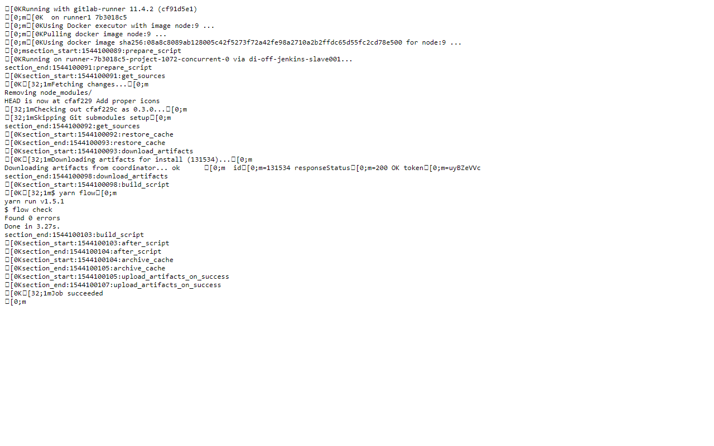
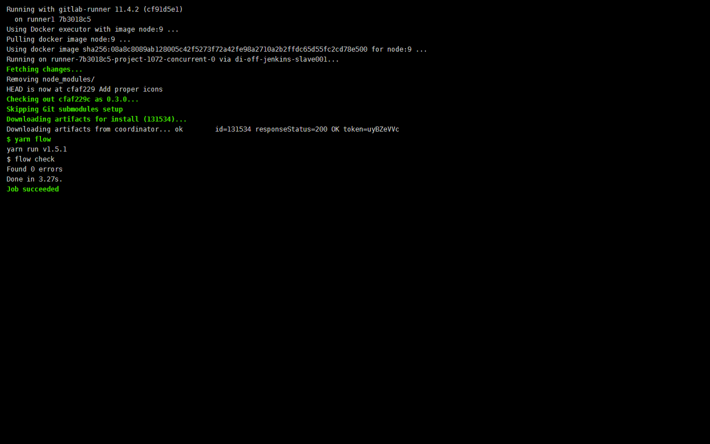

# Terminal Colors for GitLab CI

**Terminal Colors for GitLab CI** is a tiny Chrome extension that provides terminal colors for GitLab CI build logs containing ANSI color codes.

It's inspired by the [JenkinsTerminalColors](https://github.com/M6Web/JenkinsTerminalColors) extension.

## Why?

GitLab CI produces a very nice xterm-like console output during a build:

After the build, however, the log can only be viewed completely if it's smaller than 500kB.
For larger logs, GitLab offers only the raw download of the build output:

With this Chrome extension, the raw build logs get the same colors as the log in GitLab:

## How?

* Install the extension
* Open a raw build log on GitLab

## Dev?

* Clone the project
* Open _Extensions_ menu in Chrome
* Enable _Developer mode_
* Click on _Load the unpacked extension_
* Select the path to the `dist` folder in your local copy of **Terminal Colors for GitLab CI**
